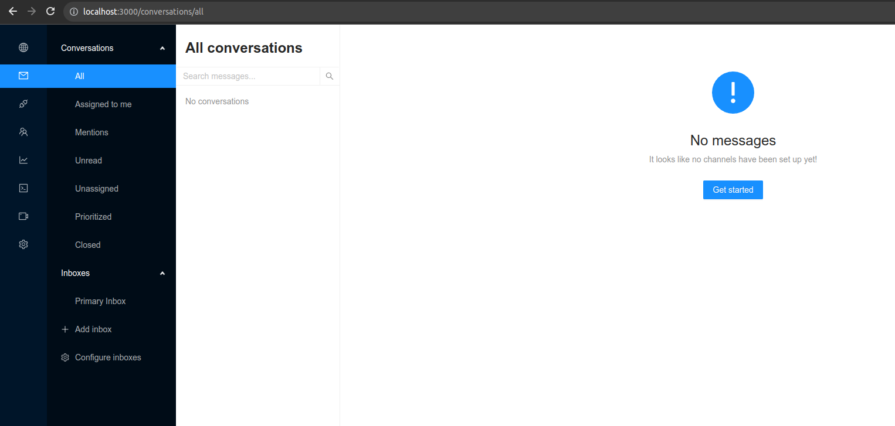

# Papercups Monorepo

Consist of papercups, chat-builder, chat-widget

# Installation

1. Copy papercups/.env.example to papercups/.env, fill the config

2. Install dependencies

```
# go to root project
cd papercups/assets
npm install

# go to root project
cd chat-builder
npm install

# go to root project
cd chat-widget
npm install
```

3. Setup backend: migrate DB, install dependencies

```
mix setup
```

# Dev Mode

### Frontend

```
cd papercups/assets
REACT_APP_STRIPE_PUBLIC_KEY=pk_{your-stripe} npm start
```

### Backend

```
iex -S mix phx.server
```

# Screenshots


